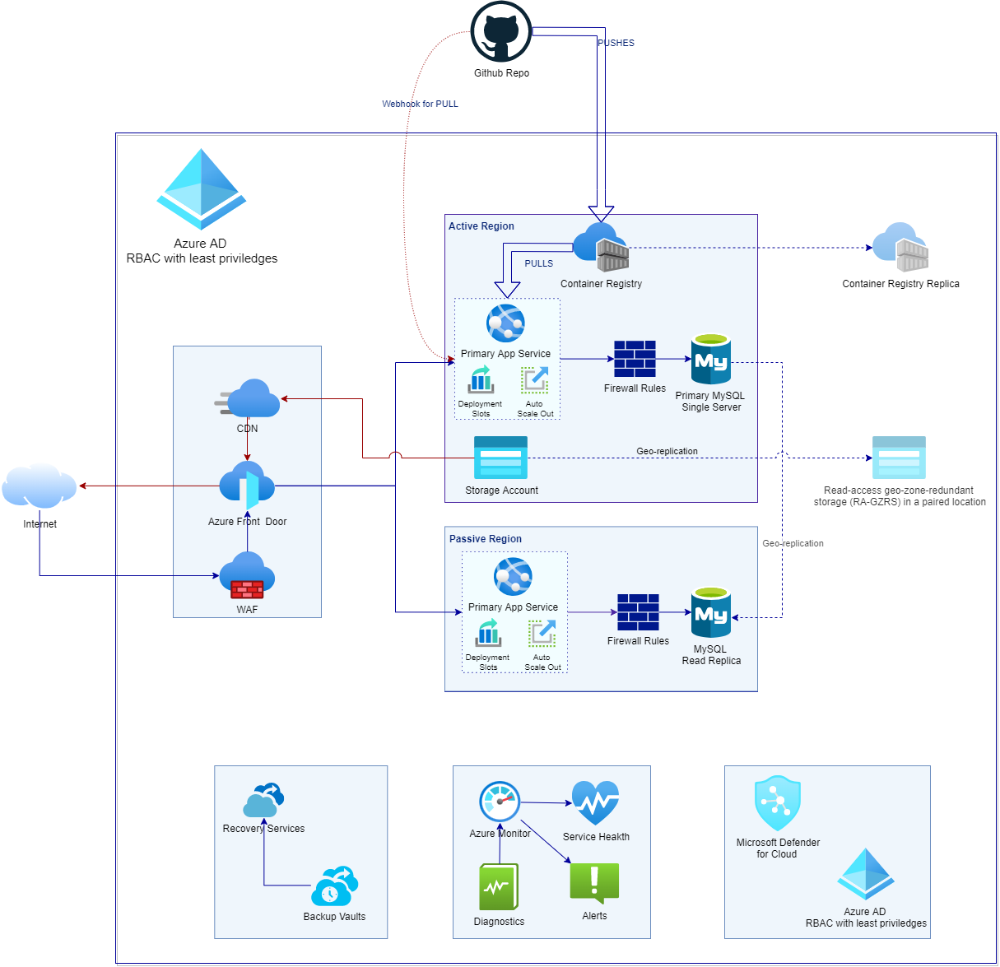

### [View all Roadmaps](https://github.com/nholuongut/all-roadmaps) &nbsp;&middot;&nbsp; [Best Practices](https://github.com/nholuongut/all-roadmaps/blob/main/public/best-practices/) &nbsp;&middot;&nbsp; [Questions](https://www.linkedin.com/in/nholuong/)
 

\* GitHub Actions deploy automatically, but for a manual deploy you will need to add a complex password (more than 8 characters, including uppercase, lowercase, numbers and symbols) the for MySQL and set the `isInitialSetup` to `true`.

\*\* GitHub actions do not work because the role assignments of the GitHub App's service principal has been removed

# Lift & Shift into Azure of a hypothetical CMS installation:

- IaC with bicep
- Azure FrontDoor
- Azure App Service (GZRS)
- Azure Storage RA-GZRS
- Azure Database for MySQL Replication
- Azure Container Registry 
- Azure Monitor
- Resource Locking

## Diagram

## GitHub setup

### Repo structure

- **bicep**: IaC with bicep. Check Bicep Description for more
- **docker**: Ghost Dockerfile and insights hack
- **function**: Azure function to delete all
- **docs**: Architecture diagram

### GitHub Secrets

- **AZURE_CREDENTIALS**: As per https://docs.microsoft.com/en-us/azure/developer/github/connect-from-azure?tabs=azure-portal%2Cwindows.
- **GHOST_MYSQL_USERNAME**: The username to connect to MySQL.
- **GHOST_MYSQL_PASSWORD**: The password to connect to MySQL.

### GitHub Actions

- **Build AzureDeploy.json**: Builds the AzureDeploy.json just for the 'Deploy to Azure' button
- **Deploy Infrastructure**: Deploys the infrastructure. Currently manual, automation will start with the application of the chosen branching model (Release-flow)
- **Push Container to ACR**: Pushes the Container to ACR.

## Bicep Description

### Module `./main.bicep`

Entry point of all definitions.

#### Module Definitions

- `./modules/logAnalyticsWorkspace.bicep` as `logAnalyticsWorkspace`
- `./modules/applicationInsights.bicep` as `applicationInsights`
- `./webAppPerRegion.bicep` as `primaryWebApp` & `secondaryWebApp`
  *\* A primary and a secondary App Service  for Geo-redundancy*
- `./modules/mySQLServer_single.bicep` as `mySQLServer`
- `./modules/frontDoor.bicep` as `frontDoor`
- `./modules/containerRegistry.bicep` as `containerRegistry`
- `./modules/keyVault.bicep` as `keyVault`
- `./modules/keyVaultSecret.bicep` as `keyVaultSecretMySqlPassword`
- `./modules/webAppSettings.bicep` as `primaryWebAppSettings` & `secondaryWebAppSettings`
   *\* Web App Settings for the primary and secondary App Service*

#### Resource Definitions

- `Microsoft.Resources/resourceGroups@2021-01-01`, *(thrice, Primary, Secondary, and Common Resource Groups)*

#### Inputs

| Param Name | Description | Type | Default |
|--|--|--|--|
| `applicationNamePrefix` | Prefix for all resources. | `string` |  'ds' |
| `primaryLocation` | The primary region location. | `string` |  'centralus' |
| `primaryResourceGroupSuffix` | A resource group suffix for the primary resource group. | `string` | '1' |
| `secondaryLocation` | The secondary region location. |`string` | 'eastus' |
| `secondaryResourceGroupSuffix` | A resource group suffix for the secondary resource group. | `string` | '1' |
| `commonLocation` | The region location for the common resource group. | `string` | 'centralus' |
| `commonResourceGroupSuffix` | A resource group suffix for the common. resource group. | `string` | 'c' |
| `commonLocation` | The region location for the common resource group | `string` | 'centralus' |
| `appServicePlanSku` | App Service Plan SKU. | `string` | 'P1v2' |
| `mySQLServerSku` | MySQL Server SKU. | `string` | 'GP_Gen5_4' |
| `logAnalyticsWorkspaceSku` | Analytics SKU | `string` | 'PerGB2018' |
| `frontDoorSku` | The SKU for the FrontDoor. Current setup is for premium. | `string` | 'Premium_AzureFrontDoor' |
| `containerRegistrySku` | The SKU for the Container Registry. | `string` | 'Premium' |
| `ghostContainerName` | Ghost container full image name and tag. | `string` | 'custom-ghost-ai' |
| `databaseName` | MySQL database name. | `string` | 'ghost' |
| `databaseUser` | MySQL username. *During CI/CD GitHub Actions overwrite this value with the `GHOST_MYSQL_USERNAME` secret.* | `string` | 'ghost' |
| `databasePassword` | MySQL password. Password requires more than 8 characters, including uppercase, lowercase, numbers and symbols. *During CI/CD GitHub Actions overwrite this value with the `GHOST_MYSQL_PASSWORD` secret.* | `string` | null |
| `ghostHealthCheckPath` | Ghost health endpoint for Load Balancers. Wait on https://github.com/TryGhost/Ghost/issues/11181 for a real one. | `string` | '/admin/site' |
| `ghostContentFileShareName` | Ghost content file share name. | `string` | 'contentfiles' |
| `ghostContentFilesMountPath` | Ghost content files mount path. | '/var/lib/ghost/content_files' |
| `isInitialSetup` | Setup for non-idempotent resources, like MySQL Replicas. | `bool` | `false` |
| `containerRegistryName` | The ACR name, which must be known to all flows. e.g. deploying infra and pushing the Docker Container to the ACR. | `string` | 'dscr5sdslxc2tc2qa' |

#### Outputs
| Param Name| Description | Type | Value |
|--|--|--|--|
| `publicUrl`  | The public URL of Azure Front Door pointing usually to the primary App. | `string` | `frontDoor.outputs.publicUrl` |

------------------------------------------------------------------------------------------------
### Module `./webAppPerRegion.bicep`
A module that packs the declarations of an Azure App Service, in order to be deployed twice, as Primary and Secondary.

#### Module Definitions

- `./modules/webApp.bicep` as `webApp`
- `./modules/appServicePlan.bicep` as `appServicePlan`
- `./modules/autoScale.bicep` as `applicationInsightsAutoScale`

#### Resource Definitions

- *None*

#### Inputs

| Param Name| Description | Type | Default |
|--|--|--|--|
| `location` | The region location for this setup. | `string` |  `null` |
| `appServicePlanSku` | App Service Plan SKU. | `string` |  'P1v2' |
| `logAnalyticsId` | Analytics Workspace Id to register the App Service, the Service Plan and Autoscaling. | `string` | `null` |
| `ghostContainerName` | Ghost container full image name. | `string` | `null` |
| `ghostHealthCheckPath` | Ghost health endpoint for Load Balancer. | `string` | `null` |
| `ghostContentFileShareName` | Ghost content file share name. | `string` | `null` |
| `ghostContentFilesMountPath` | Ghost content files mount path. | `string` | `null` |
| `storageAccountName` | The storage account name. | `string` | `null` |

#### Outputs

| Param Name | Description | Type | Value |
|--|--|--|--|
| `webAppName`  | The computed App Service Name | string | `webApp.outputs.name` |
| `webAppPrincipalId`  |The Service Principal ID for this App Service | string | `webApp.outputs.principalId` |
| `webAppHostName`  | The host name of this App Service. | string | `webApp.outputs.hostName` |
| `webAppOutboundIpAddresses`  | The outbound IP addresses of this App. Service | string | `webApp.outputs.outboundIpAddresses` |

------------------------------------------------------------------------------------------------

### Module `./modules/webApp.bicep`

The Azure App Service definition.

#### Resource Definitions

- `Microsoft.Web/sites@2021-01-15` as `webApp`
- `Microsoft.Web/sites/config@2021-01-15` as `siteConfig`
- `Microsoft.Web/sites/slots@2020-06-01`, as  `array webAppEnvironments` 
   *\* One for each environment (currently supports Production and Staging)*
- `Microsoft.Insights/diagnosticSettings@2021-05-01-preview` as `webAppDiagnostics`

#### Inputs

| Param Name | Description | Type | Default |
|--|--|--|--|
| `location` | The region location for this setup. | `string` |  `null` |
| `appServicePlanId` | App Service Plan id to host the app. | `string` |  `null` |
| `logAnalyticsWorkspaceId` | Analytics Workspace Id to register the App Service. | `string` | `null` |
| `ghostContainerImage` | Ghost container full image name. | `string` | `null` |
| `ghostHealthCheckPath` | Ghost health endpoint for Load Balancer. | `string` | `null` |
| `ghostContentFileShareName` | Ghost content file share name. | `string` | `null` |
| `ghostContentFilesMountPath` | Ghost content files mount path. | `string` | `null` |
| `storageAccountName` | The storage account name. | `string` | `null` |

#### Outputs

| Param Name | Description | Type | Value |
|--|--|--|--|
| `name` | The name of the created App Service. | `string` | `webApp.name` |
| `hostName` | The host name of this App Service. | `string` | `webApp.properties.hostNames[0]` |
| `outboundIpAddresses` | The outbound IP addresses of this App Service. | `string` | `webApp.properties.outboundIpAddresses` |
| `principalId` | The Service Principal ID for this App Service. | `string` | `webApp.identity.principalId` |

------------------------------------------------------------------------------------------------

### Module `'./modules/appServicePlan.bicep'`

The Service Plan definition.

#### Resource Definitions

- `Microsoft.Web/serverfarms@2021-02-01` as `appServicePlan`
- `Microsoft.Insights/diagnosticSettings@2021-05-01-preview` as `appServicePlanDiagnostics`

#### Inputs
| Param Name | Description | Type | Default |
|--|--|--|--|
| `appServicePlanSku` | App Service Plan SKU. | `string` | `null` |
| `location` | The region location for this setup. | `string` |  `resourceGroup().location` |
| `logAnalyticsWorkspaceId ` | Log Analytics workspace id to use for diagnostics settings. | `string` |  `null` |

#### Outputs
| Param Name | Description | Type | Value |
|--|--|--|--|
| `id` | The Id of the created Service Plan. | `string` | `appServicePlan.id` |

------------------------------------------------------------------------------------------------
### Module `'./modules/autoScale.bicep'`

The Autoscaling configuration for the App Service.

#### Resource Declarations

- `Microsoft.Insights/autoscalesettings@2014-04-01` as `appAutoScaleSettings`
- `Microsoft.Insights/diagnosticSettings@2021-05-01-preview` as `appAutoScaleSettingsDiagnostics`

#### Inputs

| Param Names | Description | Type | Default |
|--|--|--|--|
| `maximumCapacity` | The minimum capacity. Autoscale engine will ensure the instance count is at least this value. | `int` | `3` |
| `minimumCapacity` | The maximum capacity. Autoscale engine will ensure the instance count is not greater than this value. | `int` | `6` |
| `defaultCapacity` | The default capacity. | `int` | `3` |
| `metricName` | The metric name for calculating availability. | `string` | `CpuPercentage` |
| `metricThresholdToScaleOut` | The metric upper threshold. If the metric value is above this threshold then autoscale engine will initiate scale out action. | `int` | `85` |
| `metricThresholdToScaleIn` | The metric lower threshold. If the metric value is below this threshold then autoscale engine will initiate scale in action. | `int` | `60` |
| `autoscaleEnabled` | A boolean to indicate whether the autoscale policy is enabled or disabled. | `bool` | `true` |
| `location` |  The region location for this setup. | `string` |  `resourceGroup().location` |
| `appServicePlanNameId` |  The Id of the Service Plan. | `string` |  `null` |
| `logAnalyticsWorkspaceId` | Log Analytics workspace id to use for diagnostics settings. | `string` |  `null` |

#### Outputs

| Param Names | Description | Type | Value |
|--|--|--|--|
| *None*

------------------------------------------------------------------------------------------------

### Module `./modules/logAnalyticsWorkspace.bicep`

The workspace for the analytics (Solution Monitoring).

#### Resource Declarations

- `Microsoft.OperationalInsights/workspaces@2021-06-01` as `logAnalyticsWorkspace`
 
#### Inputs

| Param Names | Description | Type | Default |
|--|--|--|--|
| `logAnalyticsWorkspaceSku` | Log Analytics workspace SKU. | `string` |  `null` |
 | `location` |  The region location for this setup. | `string` |  `resourceGroup().location` |

#### Outputs

| Param Names | Description | Type | Value |
|--|--|--|--|
| `id` | The created Analytics Workspace Id | `string` | `logAnalyticsWorkspace.id` |

------------------------------------------------------------------------------------------------

### Module `./modules/applicationInsights.bicep`

The Application Insights definition.

#### Resource Definitions

- `Microsoft.Insights/components@2020-02-02` as `applicationInsights`
- `Microsoft.Insights/diagnosticSettings@2021-05-01-preview` as `applicationInsightsDiagnostics`

#### Inputs

| Param Name | Description | Type | Default |
|--|--|--|--|
| `location` |  The region location for this setup. | `string` |  `resourceGroup().location` |
| `id` | Log Analytics workspace id to use for diagnostics settings. | string | `logAnalyticsWorkspace.id` |

#### Outputs

| Param Name | Description | Type | Value |
|--|--|--|--|
| `InstrumentationKey` | The Instrumentation Key for Application Insights | `string` | `applicationInsights.properties.InstrumentationKey` |
| `InstrumentationKey` | The Connection string for Application Insights | `string` | `applicationInsights.properties.ConnectionString` |

------------------------------------------------------------------------------------------------

### Module `./modules/storageAccount.bicep`

The Storage Account setup for Ghost's files.

#### Resource Definitions

- `Microsoft.Storage/storageAccounts@2021-09-01` as `storageAccount`
- `Microsoft.Storage/storageAccounts/fileServices@2021-04-01` as `fileServices`
- `Microsoft.Insights/diagnosticSettings@2021-05-01-preview`  as `storageAccountDiagnostics` & `fileServicesDiagnostics`
  *\* One for the Storage Account and one for the File Services*
- `Microsoft.Storage/storageAccounts/fileServices/shares@2021-04-01` as `fileShare`
- `Microsoft.DataProtection/BackupVaults@2022-03-01` as backUpVault
- `Microsoft.DataProtection/BackupVaults/backupPolicies@2022-03-01` as `backUpVaultPolicy`
- `Microsoft.DataProtection/backupVaults/backupInstances@2022-03-01` as `backUpVaultInstance`
 *\* Deploys only during initial deployment (when `isInitialSetup=true`)*
- `Microsoft.Authorization/roleAssignments@2020-04-01-preview`  as `roleAssignmentsPrimaryWebApp` & `roleAssignmentSecondaryWebApp`
   *\* One for the Storage Account and one for the File Services*
   *\*\* Deploys only during initial deployment (when `isInitialSetup=true`)*

#### Inputs

| Param Names | Description | Type | Default |
|--|--|--|--|
| `storageAccountSku` | Storage Account SKU. | string | 'Standard_GRS' |
| `fileShareFolderName` | File share to store Ghost content files. | string | `null` | 
| `location` |  The region location for this setup. | `string` |  `resourceGroup().location` |
| `logAnalyticsWorkspaceId` | Log Analytics workspace id to use for diagnostics settings. | `string` |  `null` |
| `webAppPrimaryPrincipalId` | The Service Principal ID of the primary App Service. | `string` |  `null` |
| `webAppSecondaryPrincipalId` | The Service Principal ID of the secondary App Service. | `string` |  `null` |
| `isInitialSetup` | Flag for non-idempotent resources. | `bool` |  `null` |
| `storageAccountName` | The name of the storage account. | `string` |  `null` |

#### Outputs

| Param Name | Description | Type | Value |
|--|--|--|--|
| `id`  | The Id of the created Storage Account | `string` | `storageAccount.id` |
| `name`  | The Name of the created Storage Account | `string` | `storageAccount.name` |
| `fileShareFullName`  | The Name of File Share | `string` | `fileShare.name` |

------------------------------------------------------------------------------------------------
### Module `./modules/mySQLServer_single.bicep`

The MySQL Server setup for Ghost's database with replication. Single Server has been chosen because of the cross-region read replicas. 

#### Resource Declarations

- `Microsoft.DBforMySQL/servers@2017-12-01`  as `mySQLServerPrimary` & `mySQLServerSecondary`
   *\*Twice, one Primary and one for the Replica*
- `Microsoft.DBforMySQL/servers/firewallRules@2017-12-01`  as `firewallRulesPrimary1`, `firewallRulesPrimary2`, `firewallRulesSecondaryInitialSetup1`, `firewallRulesSecondaryInitialSetup2`, `firewallRulesSecondarySubsequentSetup1` & `firewallRulesSecondarySubsequentSetup2`
   *\*Multiple Times, one for each App Services IP, for initial setup (when `isInitialSetup=true`) and for subsequent deploys `isInitialSetup=false`*
- `Microsoft.DBforMySQL/servers/securityAlertPolicies@2017-12-01`  as `mySQLServerSecurityAlertsPrimary` & `mySQLServerSecurityAlertsSecondary`
   *\*Twice, one for the Primary and one for the Replica*
- `Microsoft.Insights/diagnosticSettings@2021-05-01-preview`  as `mySQLServerPrimaryDiagnostics` & `mySQLServerPrimaryDiagnostics`
   *\*Twice, one for the Primary and one for the Replica*

#### Inputs

| Param Name | Description | Type | Default |
|--|--|--|--|
| `mySQLServerSku` | MySQL Server SKU. | string | 'GP_Gen5_4' |
| `administratorLogin` | MySQL Server administrator login name. | `string` | `null` |
| `administratorPassword` | MySQL Server administrator password. | `string` | `null` |
| `primaryLocation` | Location for the Primary MySQL Server. | `string` | `null` |
| `primaryLocation` | Location for the Primary MySQL Server. | `string` | `null` |
| `secondaryLocation` | Location for the Replica MySQL Server. | `string` | `null` | 
| `secondaryLocation` | Location for the Replica MySQL Server. | `string` | `null` | 
| `webAppPrimaryOutboundIpAddresses` | IP addresses of the Primary App Service. | `string` | `null` | 
| `webAppPrimaryOutboundIpAddresses` | IP addresses of the Primary App Service. | `string` | `null` | 
| `webAppSecondaryOutboundIpAddresses` | IP addresses of the Secondary App Service. | `string` | `null` |  
| `webAppSecondaryOutboundIpAddresses` | IP addresses of the Secondary App Service. | `string` | `null` |  
| `logAnalyticsWorkspaceId` | Log Analytics workspace id to use for diagnostics settings. | `string` |  `null` |  
| `isInitialSetup` | Flag for non-idempotent resources (replicas). | `bool` |  `null` |

#### Outputs

| Param Name | Description | Type | Value |
|--|--|--|--|
| `mySQLName` | The name of the primary MySQL Server setup| `string` | `mySQLServerPrimary.name` |
| `fullyQualifiedDomainName` | The fully qualified domain name of the primary MySQL Server setup| `string` | `mySQLServerPrimary.properties.fullyQualifiedDomainName` |

------------------------------------------------------------------------------------------------
### Module `./modules/frontDoor.bicep`

Azure FrontDoor for Active/Passive setup, WAF and CDN

#### Resource Declarations

- `Microsoft.Cdn/profiles@2021-06-01` as `frontDoor`
- `Microsoft.Network/frontdoorwebapplicationfirewallpolicies@2020-11-01` as `frontDoorWafpolicy`
- `Microsoft.Cdn/profiles/afdendpoints@2021-06-01` as `frontDoorEndpoint`
- `Microsoft.Cdn/profiles/origingroups@2021-06-01` as `frontDoorOriginGroup`
- `Microsoft.Cdn/profiles/origingroups/origins@2021-06-01` as `frontDoorOrigingroupOrigin1` & `frontDoorOriginGroupOrigin2`
      *\*The two origins, Primary and Secondary App Service*
- `Microsoft.Cdn/profiles/afdendpoints/routes@2021-06-01` as `frontDoorEndpointRoute`
- `Microsoft.Cdn/profiles/securitypolicies@2021-06-01` as  `frontDoorWaf`
- `Microsoft.Insights/diagnosticSettings@2021-05-01-preview` as `frontDoorDiagnostics`

#### Inputs

| Param Names | Description | Type | Default |
|--|--|--|--|
| `logAnalyticsId` | Log Analytics workspace id to use for diagnostics settings. | `string` | `null` |
| `frontDoorSku` | The SKU for the Azure FrontDoor. Current setup is for premium. | `string` | `Premium_AzureFrontDoor` |
| `frontDoorOrigin1HostName` | The host name of the primary App Service. | `string` | `null` |
| `frontDoorOrigin2HostName` | The host name of the secondary App Service. | `string` | `null` |
| `healthCheckPath` | The path that will be probed as HTTPS GET for health.'. | `string` | `null` |

#### Outputs

| Param Names | Description | Type | Value |
|--|--|--|--|
| `publicUrl` | The public URL of Azure Front Door pointing usually to the primary App. | `string` | 'https://${`frontDoorName`}.azurefd.net' |
|

------------------------------------------------------------------------------------------------
### Module `./modules/containerRegistry.bicep`

The Azure Container Registry for the Docker Images of Ghost.

#### Resource Declarations

- `Microsoft.ContainerRegistry/registries@2021-12-01-preview` as `containerRegistry`
- `Microsoft.Authorization/roleAssignments@2020-10-01-preview` as `containerRegistryRoleAssignment1` & `containerRegistryRoleAssignment2`
*\*Role Assignments for the Primary and Secondary App Service*
- `Microsoft.Insights/diagnosticSettings@2021-05-01-preview` as `containerRegistryDiagnostics`

#### Inputs

| Param Names | Description | Type | Default |
|--|--|--|--|
| `location` | The SKU for the Container Registry. | `string` | `resourceGroup().location` |
| `containerRegistrySku` | The region location for this setup. | `string` | 'Premium' |
| `containerRegistryName` | ACR name must be known to other flows too, so it has to come as input. | `string` |  `null` |
| `logAnalyticsId` | Log Analytics workspace id to use for diagnostics settings. | `string` |  `null` |
| `primaryServicePrincipalId` | Service principal ID to provide access to the ACR. | `string` |  `null` |
| `secondaryServicePrincipalId` | Service principal ID to provide access to the ACR. | `string` |  `null` |
| `isInitialSetup` | Setup for non-idempotent resources. | `bool` | `null` |

#### Outputs

| Param Names | Description | Type | Value |
|--|--|--|--|
| `registryUrl` | The ACR URL for pushing and pulling docker images | string | https://${`containerRegistry.properties.loginServer`} |

------------------------------------------------------------------------------------------------

### Module `./modules/keyVault.bicep`

#### Resource Declarations

- `Microsoft.KeyVault/vaults@2021-04-01-preview` as `keyVault`
- `Microsoft.Insights/diagnosticSettings@2021-05-01-preview` as `keyVaultDiagnostics`

#### Inputs

| Param Names | Description | Type | Default |
|--|--|--|--|
| `location` | The SKU for the Container Registry. | `string` | `resourceGroup().location` |
| `logAnalyticsWorkspaceId` | Log Analytics workspace id to use for diagnostics settings. | `string` |  `null` |
| `primaryServicePrincipalId` | Service principal ID to provide access to the vault secrets for the Primary App Service. | `string` |  `null` |
| `secondaryServicePrincipalId` | Service principal ID to provide access to the vault secrets for the Secondary App Service. | `string` |  `null` |

#### Outputs
| Param Names | Description | Type | Value |
|--|--|--|--|
| `keyVaultName` | The name of the KeyVault. | `string` | `keyVault.name` |

------------------------------------------------------------------------------------------------

### Module `./modules/keyVaultSecret.bicep`

#### Resource Declarations

- `Microsoft.KeyVault/vaults/secrets@2019-09-01` as `keyVaultSecret`

#### Inputs

| Param Names | Description | Type | Default |
|--|--|--|--|
| `keyVaultSecretName` | The name of the secret. | string | `null` |
| `keyVaultSecretValue` | The secret. | string | `null` |
| `keyVaultName` | The KeyVault that keeps the secrets. | string | `null` |
  
#### Outputs

| Param Names | Description | Type | Value |
|--|--|--|--|
| `databaseSecretUri` | The Uri for inserted secret. | string | `keyVaultSecret.properties.secretUri` |

------------------------------------------------------------------------------------------------

### Module .`/modules/webAppSettings.bicep`

The App Service settings for both the primary and the secondary App Service. It is referenced twice in `main.bicep`, once for each App Service.

#### Resource Declarations

- `existing Microsoft.Web/sites@2020-09-01` as `existingWebApp`
- *\* Assumes an existing App Service and references it by name (see param `webAppName`)*
- `Microsoft.Web/sites/config@2021-01-15` as `webAppSettings`

#### Inputs

| Param Names | Description | Type | Default |
|--|--|--|--|
| `webAppName` | Description | string | `null` |
| `applicationInsightsInstrumentationKey` | Description | `string` | `null` |
| `applicationInsightsConnectionString` | Description | `string` | `null` |
| `databaseHostFQDN` | MySQL server hostname. | `string` | `null` |
| `databaseName` | Ghost database name. | `string` | `null` |
| `databaseUser` | Ghost database user name. | `string` | `null` |
| `databasePasswordSecretUri` | Ghost database user password. | `string` | `null` |  
| `siteUrl` | Website URL to autogenerate links by Ghost. | `string` | `null` |  
| `containerMountPath` | Mount path for Ghost content files. | `string` | `null` |  
| `containerRegistryUrl` | Container registry to pull Ghost docker image. | `string` | `null` |  
 
#### Outputs

| Param Names | Description | Type | Value |
|--|--|--|--|
| *None*

## 🚀 I'm are always open to your feedback🇻🇳🇻🇳🇻🇳🇻🇳🇻🇳🇻🇳🇻🇳🇻🇳🇻🇳🇻🇳🇻🇳🇻🇳🇻🇳🇻🇳🇻🇳🇻🇳

# **[Contact Me🇻🇳🇻🇳🇻🇳🇻🇳🇻🇳🇻🇳🇻🇳]**
* [Name: Nho Luong]
* [Skype](luongutnho_skype)
* [Github](https://github.com/nholuongut/)
* [Linkedin](https://www.linkedin.com/in/nholuong/)
* [Email Address](luongutnho@hotmail.com)
* [PayPal.Me](https://www.paypal.com/paypalme/nholuongut)

# License🇻🇳🇻🇳🇻🇳🇻🇳🇻🇳🇻🇳🇻🇳🇻🇳
* Nho Luong (c). All Rights Reserved.🌟
